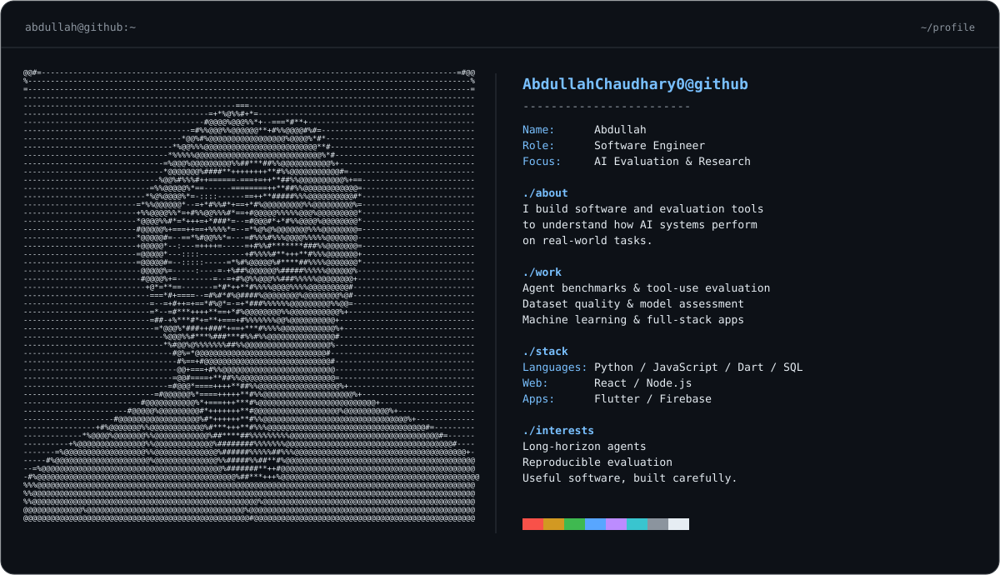

<picture>
  <source media="(prefers-color-scheme: dark)" srcset="dark_mode.svg">
  <source media="(prefers-color-scheme: light)" srcset="light_mode.svg">
  
</picture>

  <a href="https://github.com/AbdullahChaudhary0?tab=repositories">Explore my repositories</a>
  &nbsp; / &nbsp;
  <a href="https://github.com/AbdullahChaudhary0/rl-environment">Reinforcement Learning Environment</a>

